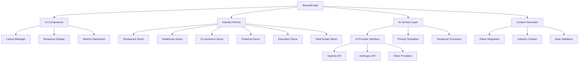

# Design Document

## Overview

The Context Engineering Demo implements a dual-version approach: a static fallback version (`app.py`) and an AI-powered version (`main.py`). The design maintains the existing user experience while introducing real AI integration and a clean, extensible architecture. The system demonstrates authentic AI behavior differences between generic and contextual prompting strategies while ensuring demo reliability through the static fallback.

## Architecture

### High-Level Architecture



### Module Structure

```
├── app.py                    # Static demo version (safe fallback)
├── main.py                   # AI-powered demo version (full experience)
├── run_demo.py              # Demo runner script for easy version switching
├── config/
│   ├── __init__.py
│   ├── settings.py          # Configuration management
│   └── ai_config.py         # AI provider configurations
├── services/
│   ├── __init__.py
│   ├── ai_service.py        # AI integration layer
│   ├── openai_provider.py   # OpenAI provider implementation
│   ├── context_service.py   # Context generation service
│   └── prompt_service.py    # Prompt template management
├── demos/
│   ├── __init__.py
│   ├── base_demo.py         # Base demo class
│   ├── restaurant_demo.py   # Restaurant industry demo
│   ├── healthcare_demo.py   # Healthcare industry demo
│   └── [other_demos].py     # Additional industry demos
├── ui/
│   ├── __init__.py
│   ├── components.py        # Reusable UI components
│   └── layout.py           # Layout management
└── utils/
    ├── __init__.py
    ├── error_handler.py     # Error handling utilities
    └── logger.py           # Logging configuration
```

## Components and Interfaces

### AI Service Layer

**Purpose:** Centralized AI integration with support for multiple providers

**Key Classes:**
- `AIProvider` (Abstract base class)
- `OpenAIProvider` (OpenAI implementation)
- `AnthropicProvider` (Anthropic implementation)
- `GeminiProvider` (Google Gemini implementation)
- `OpenRouterProvider` (OpenRouter implementation)
- `AIService` (Main service orchestrator)

**Interface:**
```python
class AIService:
    def generate_generic_response(self, query: str, industry: str) -> str
    def generate_contextual_response(self, query: str, context: dict, industry: str) -> str
    def set_provider(self, provider_name: str) -> None
    def get_available_providers(self) -> List[str]
```

### Context Service

**Purpose:** Generate realistic, industry-specific context data using Faker

**Key Classes:**
- `ContextGenerator` (Main generator)
- `IndustryContextFactory` (Factory for industry-specific contexts)

**Interface:**
```python
class ContextService:
    def generate_context(self, industry: str) -> dict
    def refresh_context(self, industry: str) -> dict
    def validate_context(self, context: dict, industry: str) -> bool
```

### Demo Framework

**Purpose:** Standardized framework for industry demonstrations

**Base Class:**
```python
class BaseDemo:
    def __init__(self, ai_service: AIService, context_service: ContextService)
    def render(self) -> None
    def handle_query(self, query: str) -> Tuple[str, str]  # generic, contextual
    def get_sample_queries(self) -> List[str]
```

### UI Components

**Purpose:** Reusable Streamlit components for consistent interface

**Key Functions:**
- `render_comparison_columns(generic_response, contextual_response, context)`
- `render_metrics_dashboard()`
- `render_context_expander(context_data)`
- `render_industry_selector()`

## Data Models

### AI Configuration
```python
@dataclass
class AIConfig:
    provider: str
    api_key: str
    model: str
    temperature: float = 0.7
    max_tokens: int = 500
    timeout: int = 30
```

### Context Data Structure
```python
@dataclass
class IndustryContext:
    industry: str
    user_profile: dict
    situational_data: dict
    preferences: dict
    history: dict
    constraints: dict
```

### Response Data
```python
@dataclass
class AIResponse:
    content: str
    provider: str
    model: str
    tokens_used: int
    response_time: float
    success: bool
    error_message: Optional[str] = None
```

## Error Handling

### Error Categories
1. **AI Provider Errors:** API failures, rate limits, authentication
2. **Configuration Errors:** Missing API keys, invalid settings
3. **Network Errors:** Timeouts, connectivity issues
4. **Data Validation Errors:** Invalid context data, malformed queries

### Error Handling Strategy
- **Graceful Degradation:** Fall back to alternative providers or cached responses
- **User-Friendly Messages:** Convert technical errors to actionable user guidance
- **Logging:** Comprehensive error logging for debugging without exposing sensitive data
- **Retry Logic:** Automatic retry with exponential backoff for transient failures

### Error Handler Implementation
```python
class ErrorHandler:
    def handle_ai_error(self, error: Exception, context: dict) -> str
    def handle_config_error(self, error: Exception) -> None
    def log_error(self, error: Exception, context: dict) -> None
    def get_fallback_response(self, query: str, industry: str) -> str
```

## Testing Strategy

### Unit Testing
- **AI Service Tests:** Mock AI providers, test response processing
- **Context Service Tests:** Validate generated context data quality
- **Demo Tests:** Test query handling and response generation
- **UI Component Tests:** Test component rendering and interaction

### Integration Testing
- **End-to-End Flows:** Test complete user journeys through each industry demo
- **AI Provider Integration:** Test actual API calls with test accounts
- **Error Scenarios:** Test error handling and fallback mechanisms

### Performance Testing
- **Response Time:** Ensure AI calls complete within acceptable timeframes
- **Concurrent Users:** Test application behavior under load
- **Memory Usage:** Monitor memory consumption with large context data

### Test Structure
```
tests/
├── unit/
│   ├── test_ai_service.py
│   ├── test_context_service.py
│   └── test_demos.py
├── integration/
│   ├── test_ai_providers.py
│   └── test_end_to_end.py
└── fixtures/
    ├── mock_responses.py
    └── test_contexts.py
```

## Configuration Management

### Environment Variables
- `AI_PROVIDER`: Default AI provider (openai, anthropic)
- `OPENAI_API_KEY`: OpenAI API key
- `ANTHROPIC_API_KEY`: Anthropic API key
- `LOG_LEVEL`: Logging level (DEBUG, INFO, WARNING, ERROR)
- `ENABLE_CACHING`: Enable response caching (true/false)

### Configuration Files
- `config/settings.py`: Application settings and defaults
- `config/ai_config.py`: AI provider configurations and prompts
- `.env`: Environment-specific variables (not committed to repo)

### Prompt Templates
Centralized prompt management for consistent AI interactions:
- Generic prompts: Basic responses without context
- Contextual prompts: Enhanced responses using user context
- Industry-specific prompt variations
- Error handling prompts for fallback scenarios

## Security Considerations

### API Key Management
- Store API keys in environment variables
- Never commit API keys to version control
- Implement key rotation capabilities
- Use separate keys for development and production

### Data Privacy
- No persistent storage of user queries or AI responses
- Context data generated fresh for each session
- No logging of sensitive user information
- Clear data handling policies in documentation

### Rate Limiting
- Implement client-side rate limiting to prevent API abuse
- Handle rate limit responses gracefully
- Queue requests during high usage periods
- Monitor API usage and costs