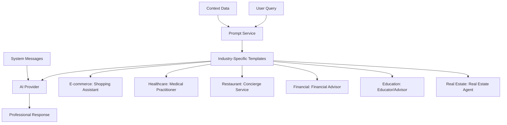

# Design Document

## Overview

The current prompt system instructs AI to act as business consultants providing industry advice, but users expect customer-facing professional interactions. This design transforms the prompt templates across all six industry demos to make AI respond as appropriate professionals: shopping assistants, medical practitioners, concierge services, financial advisors, educators, and real estate agents. The solution maintains the existing modular architecture while completely rewriting prompt templates and response strategies.

## Architecture

### Current vs. Desired Behavior

**Current Problem:**
- User: "Show me running shoes for women"
- AI Response: "Here are best practices for selling women's running shoes online..."

**Desired Solution:**
- User: "Show me running shoes for women"  
- AI Response: "Here are some great women's running shoes I'd recommend..."

### System Components Affected



## Components and Interfaces

### Prompt Template Redesign

The core change involves rewriting all prompt templates in `services/prompt_service.py` to change the AI's role from business consultant to customer-facing professional.

#### Template Structure Changes

**Current Generic Template Pattern:**
```
"Please provide [industry] guidance. Focus on best practices for [business operations]..."
```

**New Generic Template Pattern:**
```
"You are a helpful [professional role]. The user is asking: {query}. Provide direct, helpful assistance as a [professional role] would..."
```

**Current Contextual Template Pattern:**
```
"Based on the [industry] context provided, offer specific guidance that considers the business..."
```

**New Contextual Template Pattern:**
```
"You are a [professional role] helping this specific customer. Use their profile: {context}. Provide personalized recommendations..."
```

### Industry-Specific Professional Roles

#### E-commerce: Shopping Assistant
- **Role:** Personal shopping assistant helping customers find products
- **Generic Response:** Product recommendations, comparisons, general shopping advice
- **Contextual Response:** Personalized recommendations based on purchase history, preferences, budget

#### Healthcare: Medical Practitioner  
- **Role:** Healthcare professional providing medical guidance
- **Generic Response:** General health information, medical advice, wellness tips
- **Contextual Response:** Personalized health recommendations based on medical history, conditions, preferences

#### Restaurant: Concierge Service
- **Role:** Concierge helping with restaurant selection and dining
- **Generic Response:** Restaurant recommendations, dining suggestions, reservation guidance
- **Contextual Response:** Personalized dining recommendations based on preferences, dietary restrictions, location

#### Financial: Financial Advisor
- **Role:** Personal financial advisor providing financial guidance
- **Generic Response:** General financial advice, investment principles, planning tips
- **Contextual Response:** Personalized financial recommendations based on goals, risk tolerance, current situation

#### Education: Educator/Academic Advisor
- **Role:** Educational advisor helping with learning and academic decisions
- **Generic Response:** General educational guidance, learning resources, academic advice
- **Contextual Response:** Personalized educational recommendations based on learning style, goals, background

#### Real Estate: Real Estate Agent
- **Role:** Real estate agent helping with property needs
- **Generic Response:** General property advice, market information, buying/selling guidance
- **Contextual Response:** Personalized property recommendations based on budget, preferences, location needs

## Data Models

### Enhanced Prompt Template Structure

```python
@dataclass
class ProfessionalPromptTemplate:
    name: str
    template: str
    professional_role: str  # New field
    customer_focus: bool    # New field
    response_style: str     # New field (conversational, professional, friendly)
    prompt_type: PromptType
    industry: Optional[Industry] = None
    variables: List[str] = field(default_factory=list)
    description: str = ""
    metadata: Dict[str, Any] = field(default_factory=dict)
```

### Response Format Guidelines

Each industry will have specific response formatting guidelines:

```python
@dataclass
class ResponseGuidelines:
    industry: Industry
    professional_role: str
    tone: str  # friendly, professional, caring, etc.
    structure: List[str]  # ordered list of response sections
    personalization_elements: List[str]  # what to reference from context
    call_to_action: str  # how to end responses
```

## Error Handling

### Professional Role Validation
- Validate that each template defines appropriate professional role
- Ensure response guidelines match industry expectations
- Verify personalization elements are relevant to industry context

### Response Quality Checks
- Monitor responses to ensure they maintain professional role
- Check that contextual responses properly use customer data
- Validate that responses are customer-focused, not business-focused

## Testing Strategy

### Template Validation Testing
- Test each industry template with sample queries
- Verify generic responses act as appropriate professional
- Confirm contextual responses properly personalize using context data

### Response Quality Testing
- Compare old vs. new response styles
- Test with real user queries from each industry
- Validate that responses feel like professional service interactions

### Cross-Industry Consistency Testing
- Ensure all industries maintain consistent quality
- Test that professional roles are appropriate and helpful
- Verify contextual personalization works across all industries

## Implementation Details

### Prompt Template Updates

#### System Messages
Each industry needs updated system messages that define the AI's professional role:

```python
# E-commerce System Message
"You are a helpful personal shopping assistant. Your goal is to help customers find exactly what they're looking for. Be friendly, knowledgeable about products, and focus on the customer's needs and preferences."

# Healthcare System Message  
"You are a knowledgeable healthcare professional. Provide helpful medical information and health guidance. Always emphasize the importance of consulting with healthcare providers for specific medical concerns."

# Restaurant System Message
"You are a professional concierge service specializing in dining experiences. Help customers find the perfect restaurants, make reservations, and provide dining recommendations based on their preferences."
```

#### Generic Templates
Transform business consultation templates into customer service templates:

```python
# E-commerce Generic Template
"A customer is asking: {query}\n\nAs their personal shopping assistant, provide helpful product recommendations and shopping guidance. Be specific, friendly, and focus on helping them find what they need."

# Healthcare Generic Template  
"A patient is asking: {query}\n\nAs a healthcare professional, provide helpful medical information and health guidance. Be caring, informative, and always emphasize consulting with healthcare providers."
```

#### Contextual Templates
Enhance personalization using customer context:

```python
# E-commerce Contextual Template
"You are helping a specific customer with their shopping needs.\n\nCustomer Query: {query}\n\nCustomer Profile: {context}\n\nUse their purchase history, preferences, and profile to provide personalized product recommendations. Reference their specific situation naturally."

# Healthcare Contextual Template
"You are providing personalized health guidance to a specific patient.\n\nPatient Question: {query}\n\nPatient Profile: {context}\n\nUse their health history, conditions, and preferences to provide personalized health recommendations. Always emphasize consulting with their healthcare providers."
```

### Response Enhancement Strategies

#### Personalization Elements by Industry

**E-commerce:**
- Reference purchase history and favorite brands
- Consider budget and price sensitivity  
- Mention loyalty status and member benefits
- Use preferred payment and shipping methods

**Healthcare:**
- Reference medical history and current conditions
- Consider age, lifestyle, and health goals
- Mention previous treatments or medications
- Use preferred communication style

**Restaurant:**
- Reference dining preferences and dietary restrictions
- Consider location and occasion type
- Mention previous restaurant visits
- Use preferred cuisine types and price ranges

**Financial:**
- Reference financial goals and risk tolerance
- Consider current financial situation
- Mention investment history and preferences
- Use preferred communication and meeting styles

**Education:**
- Reference learning style and academic background
- Consider career goals and interests
- Mention previous courses or achievements
- Use preferred learning methods

**Real Estate:**
- Reference property preferences and budget
- Consider location requirements and lifestyle
- Mention previous property history
- Use preferred property types and features

## Security Considerations

### Professional Boundaries
- Ensure healthcare responses include appropriate disclaimers
- Financial advice should include risk warnings
- Real estate guidance should mention market variability
- Educational advice should be appropriate for the user's level

### Data Privacy
- Customer context should be used appropriately for each industry
- Sensitive information should be handled with care
- Responses should not expose inappropriate personal details
- Professional standards should be maintained across all interactions

## Performance Considerations

### Response Quality Metrics
- Measure customer satisfaction with new professional responses
- Track engagement and interaction quality
- Monitor response relevance and helpfulness
- Compare generic vs. contextual response effectiveness

### Template Efficiency
- Optimize prompt templates for token usage
- Ensure templates generate consistent, high-quality responses
- Balance personalization with response speed
- Monitor AI provider costs and usage patterns